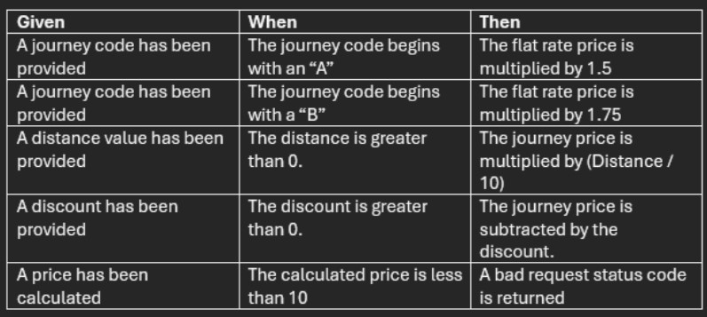

# lat-interview-technical-challenge-2

You have been tasked with creating a calculator to price up a simple journey based on a
few simple rules.

Time Limit: 20 minutes

The image above shows the acceptance criteria for the journey pricing calculator. It outlines the rules and conditions that need to be met for the calculator to function correctly.

Additional Criteria:
 - The initial flat rate journey price is 10. 
 - The journey result must be rounded down to the nearest integer.

Notes : 

Formula:
(FlatRateJourneyPrice *(JourneyCodeValue) *(Distance/ 10))- Discount

Example:
JourneyCode = "A"
Distance = 120
Discount = 15

Price = (10* 1.5) * 12- 15 = 165